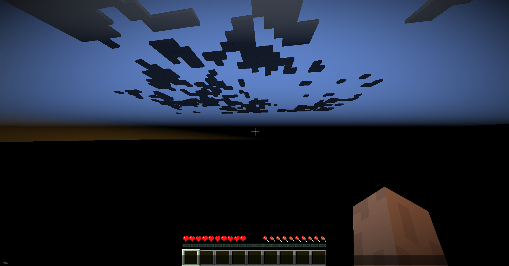

# Minecraft Server Protocol with Netty

A lightweight implementation of Minecraft server protocol using Netty.
minecraft protocol: v47 

#
For now, the project is completely finished and handshake 
and motd have been added.

## Features
- Handles Minecraft server communication
- Utilizes Netty for efficient networking
- Lightweight and simple structure

## Installation
```sh
# Clone the repository
git clone https://github.com/mustafabinguldev/hanmcserver.git

# Navigate to the project directory
cd hanmcserver

# Build the project
mvn clean package
```




## Usage
```sh
java -jar target/hanserver.jar
```

